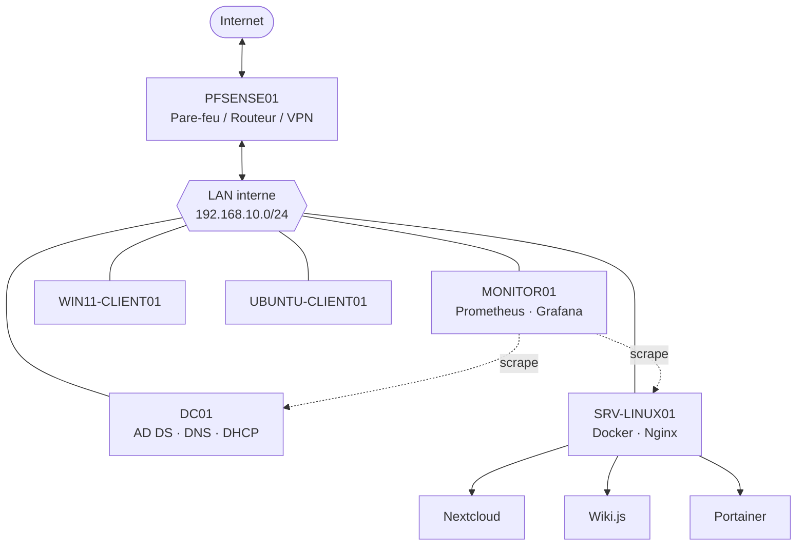

# Architecture — BihahoTech

## Vue d'ensemble

L'infrastructure BihahoTech simule un réseau d'entreprise segmenté, avec un pare-feu périmétrique séparant le réseau interne (LAN) de l'accès Internet (WAN).

## Principes de conception

- **Segmentation réseau** : le LAN (`LAN-BIHAHO`, réseau interne VirtualBox) est totalement isolé du réseau physique de l'hôte. Seul pfSense fait le pont entre les deux.
- **Filtrage en liste blanche** : aucune règle "allow all" sur le LAN. Chaque flux (LAN → DC01, LAN → SRV-LINUX01, LAN → Internet) est autorisé explicitement via des règles dédiées et des alias.
- **WAN fermé par défaut** : aucune règle "Pass" entrante sur l'interface WAN, sauf le port OpenVPN (1194/UDP) nécessaire à l'accès distant.
- **Reverse proxy unique** : Nginx sur SRV-LINUX01 centralise l'accès aux services web (Nextcloud, Wiki.js, Portainer) par nom de domaine, avec HTTPS.
- **Authentification centralisée** : DC01 (Active Directory) gère l'identité, le DNS et le DHCP de tout le LAN.
- **Supervision indépendante** : MONITOR01 interroge les autres machines (Prometheus) sans dépendre d'elles pour fonctionner.

## Composants et rôles

| Composant | Rôle |
|---|---|
| PFSENSE01 | Pare-feu, routage NAT, VPN OpenVPN, PKI interne pour le VPN |
| DC01 | Contrôleur de domaine (AD DS), DNS, DHCP, GPO |
| SRV-LINUX01 | Hébergement Docker (Nextcloud, Wiki.js, Portainer), reverse proxy Nginx, HTTPS |
| MONITOR01 | Supervision (Prometheus, Grafana, Alertmanager) |
| WIN11-CLIENT01 | Poste client Windows joint au domaine |
| UBUNTU-CLIENT01 | Poste client Linux joint au domaine (via realmd/sssd) |

## Flux réseau principaux

- **LAN → DC01** : ports AD/DNS/NTP (88, 389, 445, 464, 636, 3268, 3269, 53, 123)
- **LAN → SRV-LINUX01** : HTTP/HTTPS (80, 443) + SSH (22)
- **LAN → MONITOR01** : ports Grafana/Prometheus/Alertmanager (3000, 9090, 9093) + exporters (9100, 9182)
- **LAN → Internet** : HTTP/HTTPS/DNS uniquement (pas d'accès direct non filtré)
- **VPN → LAN** : accès distant complet au réseau `192.168.10.0/24` via tunnel `10.8.0.0/24`
