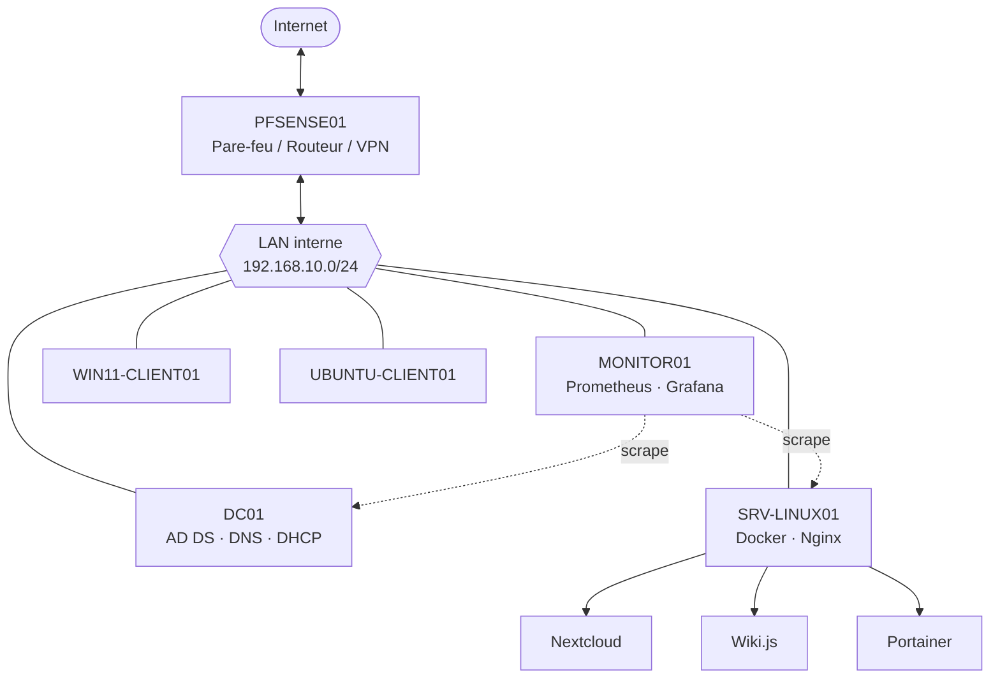

# BihahoTech — Infrastructure d'entreprise

Simulation complète d'une infrastructure informatique d'entreprise fictive (**BihahoTech**), construite de zéro dans VirtualBox : réseau, Active Directory, services applicatifs, supervision, sécurité, sauvegardes et VPN.


---

## Sommaire

- [Architecture](#architecture)
- [Machines utilisées](#machines-du-lab)
- [Stack technique](#stack-technique)
- [Structure du dépôt](#structure-du-dépôt)
- [Phases du projet](#phases-du-projet)
- [Accès aux services](#accès-aux-services)
- [Sécurité — choix et limites assumées](#sécurité--choix-et-limites-assumées)
- [Auteur](#auteur)

---

## Architecture



Le pare-feu **PFSENSE01** sépare le WAN (accès Internet via l'adaptateur Bridged) du LAN interne (Réseau interne VirtualBox `LAN-BIHAHO`). Tout le trafic LAN → Internet passe par des règles explicites (allow-list), pas de règle "allow all". Un accès distant est possible via **OpenVPN**, avec une autorité de certification interne dédiée.

---

## Machines

| Machine | Rôle | IP | OS |
|---|---|---|---|
| PFSENSE01 | Pare-feu, routeur, VPN | 192.168.10.1 (LAN) | pfSense CE 2.8.1 |
| DC01 | Contrôleur de domaine, DNS, DHCP | 192.168.10.10 | Windows Server 2025 |
| SRV-LINUX01 | Serveur applicatif (Docker) | 192.168.10.20 | Ubuntu Server 24.04 LTS |
| MONITOR01 | Supervision | 192.168.10.30 | Ubuntu Server 24.04 LTS |
| WIN11-CLIENT01 | Poste client Windows | DHCP | Windows 11 |
| UBUNTU-CLIENT01 | Poste client Linux | DHCP | Ubuntu Desktop 24.04 LTS |

Toutes les VM communiquent via le réseau interne VirtualBox `LAN-BIHAHO`, isolé du réseau physique de l'hôte.

---

## Stack technique

| Domaine | Outils |
|---|---|
| Virtualisation | VirtualBox |
| Réseau / Sécurité | pfSense (pare-feu, NAT, VPN OpenVPN, PKI interne) |
| Annuaire | Active Directory Domain Services, DNS, DHCP, GPO |
| Conteneurisation | Docker, Docker Compose |
| Applications | Nextcloud, Wiki.js, Portainer |
| Reverse proxy | Nginx (routage par nom de domaine, HTTPS) |
| Supervision | Prometheus, Grafana, Alertmanager, node_exporter, windows_exporter |
| Sauvegarde | BorgBackup (chiffré, dédupliqué), Rsync (réplication) |
| Automatisation | Scripts PowerShell (AD, GPO), Ansible (pfSense, en cours) |
| Versioning | Git / GitHub |

---

## Structure du dépôt

```
bihahotech-enterprise-infrastructure/
│
├── .gitignore
├── README.md
│
├── Docs/
│   ├── software.md
│   ├── architecture.md
│   ├── plan-adressage-ip.md
│   ├── installation-pfsense.md
│   ├── installation-dc01.md
│   ├── installation-srv-linux01.md
│   ├── installation-monitor01.md
│   ├── gestion-utilisateurs-groupes.md
│   ├── gestion-gpo.md
│   └── procedure-restauration-borgbackup.md
│
├── configs/
│   └── docker/
│       ├── nextcloud/
│       │   └── docker-compose.yml
│       ├── portainer/
│       │   └── docker-compose.yml
│       ├── wiki/
│       │   └── docker-compose.yml
│       ├── nginx/
│       │   ├── nextcloud.conf
│       │   ├── wiki.conf
│       │   └── portainer.conf
│       └── monitoring/
│           ├── docker-compose.yml
│           ├── prometheus.yml
│           └── alertmanager.yml
│
└── scripts/
    ├── setup-ad-bihahotech.ps1
    ├── setup-gpo-bihahotech.ps1
    └── backup.sh
```

---

## Phases du projet

- [x] **Phase 1** — Analyse des besoins, conception, plan d'adressage IP
- [x] **Phase 2** — Environnement VirtualBox (VM, réseaux internes)
- [x] **Phase 3** — Déploiement réseau (pfSense, routage, accès Internet)
- [x] **Phase 4** — Installation des serveurs (Windows Server, Ubuntu Server)
- [x] **Phase 5** — Services d'entreprise (AD DS, DNS, DHCP) — *Samba non réalisé*
- [x] **Phase 6** — Services Docker (Nextcloud, Wiki.js, Portainer, Nginx)
- [x] **Phase 7** — Sécurisation (règles pare-feu, VPN OpenVPN, HTTPS, GPO)
- [x] **Phase 8** — Supervision (Prometheus, Grafana, Alertmanager)
- [x] **Phase 9** — Sauvegardes (BorgBackup + Rsync, restauration testée)
- [x] **Phase 10** — Documentation

---

## Accès aux services

*(Accessible uniquement depuis le LAN interne ou via VPN)*

| Service | URL |
|---|---|
| pfSense | `https://192.168.10.1:8443` |
| Nextcloud | `https://nextcloud.bihahotech.local` |
| Wiki.js | `https://wiki.bihahotech.local` |
| Portainer | `https://portainer.bihahotech.local` |
| Grafana | `http://192.168.10.30:3000` |
| Prometheus | `http://192.168.10.30:9090` |

---

## Sécurité — choix et limites assumées

Ce projet a été construit avec une approche *secure by default* (pare-feu en liste blanche, VPN avec PKI interne, GPO de base, sauvegardes chiffrées et testées). Certains choix ont néanmoins été faits pour rester réalisable dans un lab à ressources limitées, et sont documentés ici plutôt que passés sous silence :

- **Point unique de défaillance** à chaque couche (1 seul DC, 1 seul pare-feu, 1 seul serveur applicatif) — en production, une redondance serait nécessaire à chaque niveau.
- **Certificats HTTPS auto-signés** plutôt qu'une PKI d'entreprise complète (AD CS) — fonctionnel mais génère un avertissement navigateur.
- **Service Samba** prévu initialement, non implémenté.
- **Alerting Prometheus** non configuré au-delà de la supervision passive (pas de règles d'alerte actives dans Alertmanager).
- **Comptes à privilèges** : usage du compte `Administrateur` intégré pour certaines opérations plutôt que des comptes d'administration nommés et dédiés.

---

## Auteur

Projet réalisé par **Kossi Bihaho** dans le cadre d'un apprentissage pratique en administration système, réseaux et DevOps.
